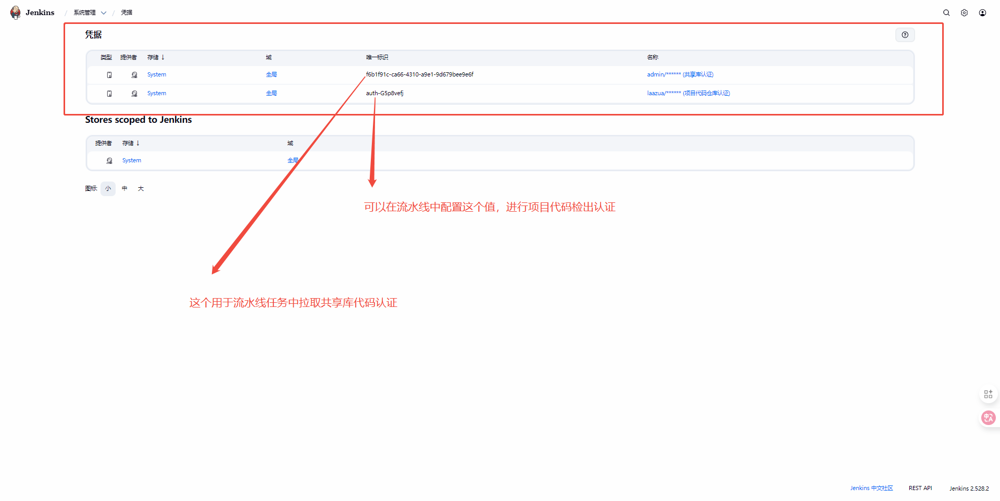
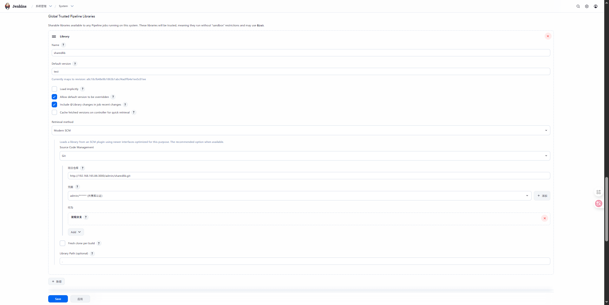
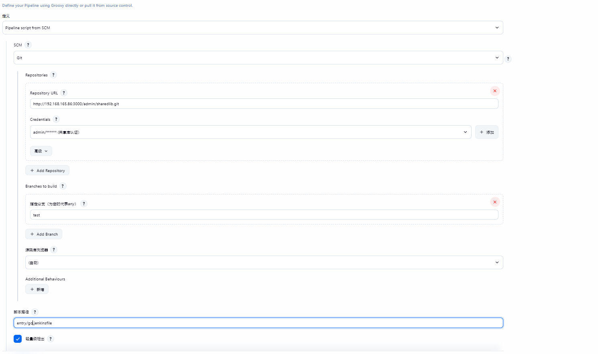

### sharedlib

- 安装插件
    + gitee
    + pipeline
    + HTTP Request

- 系统配置
    + [系统配置共享库参照](https://www.jenkins.io/zh/doc/book/pipeline/shared-libraries/)
    + 安装 Jenkins 服务的主机要安装 git 工具
    + 凭据配置(共享库仓库凭据, 制品项目仓库凭据)

- 仓库分支
  + 共享库的仓库代码需要一个分支(如： test)
  + git switch -c test
  + git push --set-upstream origin test

- Jenkins服务具体配置
    + 
    + 
    + 
